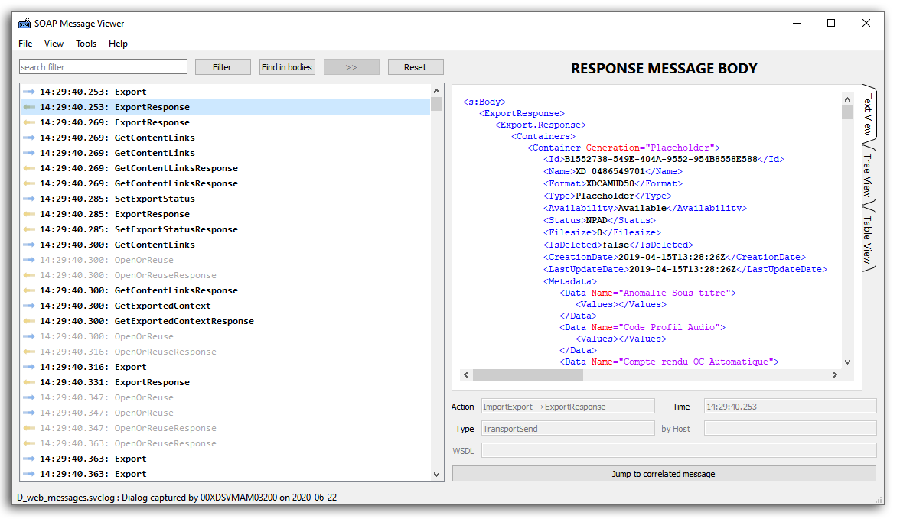

# SOAP Message Viewer

## Présentation

Lorsque deux applicatifs communiquent au protocole SOAP, il est possible d'activer des traces dans le fichier *web.config* grâce à la section `<Diagnostics>`.
On obtient alors deux fichiers XML:

- web_messages.svclog
- web_trace.svclog

L'outil habituel pour visualiser ces logs est *SvcTraceViewer.exe* (*Microsoft Service Trace Viewer*), qui présente l'inconvénient d'être lent, complexe, de nécessiter les deux fichiers avec des horaires concordants.

Le présent outil **SOAP Message Viewer** se focalise sur l'essentiel: le contenu des messages échangés. Il est rapide, simple, et ne nécessite que le fichier **web_messages.svclog**.



# Installation

L'exécutable est disponible dans la section "Release" de GitHub dans une version _portable_ (cad sans installeur. Il suffit de dézipper le fichier dans le répertoire de destination).
Les versions compilées avec MSVC nécessitent le runtime C++ de Microsoft 2015-2019 (téléchargeable via le lien fourni). Les versions compilées avec MinGW incluent directement leurs DLL runtime.

# Le coin des développeurs

### Compilation

Pour compiler vous-même ce programme, il faut **Qt Creator** avec le framework **Qt 6** (testé avec le kit *Qt 6.11.1 MinGW 64-bit*).
Le code reste compatible avec le compilateur MSVC.

Le fichier `.pro` contient les directives nécessaires à la compilation.
La librairie **Expat** n'a pas besoin d'être installée : ses sources (`Expat/src`) sont compilées directement avec le projet (lien statique), quels que soient le compilateur et l'architecture.

En ligne de commande (depuis un shell où Qt et MinGW sont dans le `PATH`) :

```
qmake SOAP-Message-Viewer.pro CONFIG+=release
mingw32-make
```

### Déploiement

Aucune DLL Expat n'est à copier. Pour la version Release, il suffit d'ajouter les DLL du framework Qt à côté du fichier **exe** avec l'outil **windeployqt.exe** :

```
windeployqt release/SOAP-Message-Viewer.exe
```

Une méthode simple est de rajouter une étape "déploiement" dans Qt Creator pour faire cette opération.

### Sources

Toutes les informations utiles au développement sont dans la [documentation doxygen](https://sphinkie.github.io/SOAP-Message-Viewer/doxygen/html/index.html) et dans la [documentation Expat](https://sphinkie.github.io/SOAP-Message-Viewer/expat/reference.html).

### La librairie Expat

[**Expat**](https://libexpat.github.io/) est un  parseur XML de type SAX, capable de traiter de gros fichiers rapidement.
Comme la méthode SAX permet de traiter les données du XML au fur et à mesure de leur lecture, la librairie peut extraire des informations utiles du fichier XML, même si celui est tronqué ou abimé à la fin.

Voir la [procédure](docs/expat/readme.md) pour mettre à jour la librairie Expat. Le projet ne contient que les sources d'Expat (`Expat/src` et `Expat/include`). Le fichier `Expat/include/expat_config.h` n'est pas fourni par Expat : il est propre au projet et doit être conservé.

## Licence

**QT** est en version OpenSource sous licence LGPL.

**Expat** est un logiciel libre sous licence MIT/X.
