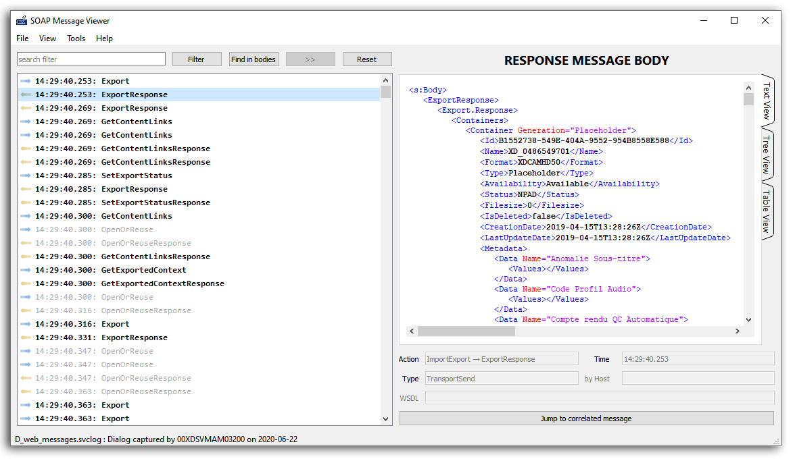

# SOAP Message Viewer for Windows

## Description

**SOAP Message Viewer** is an utility that displays the content of the messages of a SOAP trace record (ie: of a *web_messages.svclog* file).

## Why another SVCLOG viewer?

When you want to trace the dialog between a SOAP server and a client, you usually activate the _diagnostics_
in the `web.config` file. You get then these two files:
* web_messages.svclog
* web_trace.svclog

The usual utility to view and analyse this trace is *SvcTraceViewer.exe* (*Microsoft Service Trace Viewer*)
that can be slow, complex and needs that both files are synchronously timecoded.

**SOAP Message Viewer** just focuses on the main thing: the content of the messages.
It is fast, simple, and only needs the **web_messages.svclog** file.

## Features

* Can open any `.svclog` file
* Can repair truncated files
* Syntax highliting
* Search in messages
* Filter messages by name
* Find correlated messages (requests ↔ responses)
* and many other

## Installation

Get the latest release of the software by clicking on the **▼.ZIP** button, at the top of this page, or [here: "latest release"](https://github.com/Sphinkie/SOAP-Message-Viewer/releases/latest).

Download the **SOAP-MessageViewer.Portable.zip** file, and unzip it in a folder on your computer.
Then, just run the **SOAP-MessageViewer.exe** program.

## About me

Find my other softwares at [GitHub](https://sphinkie.github.io).