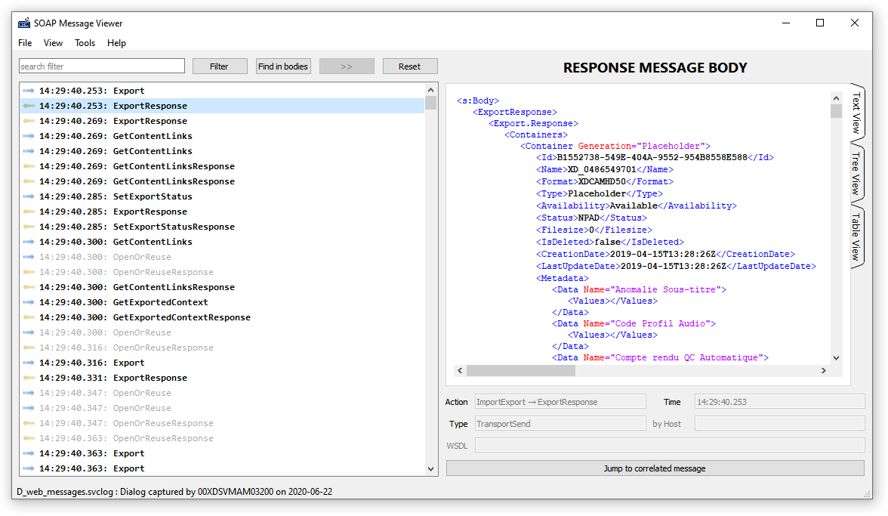

# SOAP Message Viewer

## Présentation

Lorsque deux applicatifs communiquent au protocole SOAP, il est possible d'activer des traces dans le fichier *web.config*.
On obtient alors deux fichiers XML:

- web_messages.svclog
- web_trace.svclog

L'outil habituel pour visualiser ces logs est *SvcTraceViewer.exe* (*Microsoft Service Trace Viewer*), qui présente l'inconvénient d'être lent, complexe, de nécessiter les deux fichiers avec des horaires concordants.

Le présent outil **SOAP Message Viewer** se focalise sur l'essentiel: le contenu des messages échangés. Il est rapide, simple, et ne nécessite que le fichier **web_messages.svclog**.

